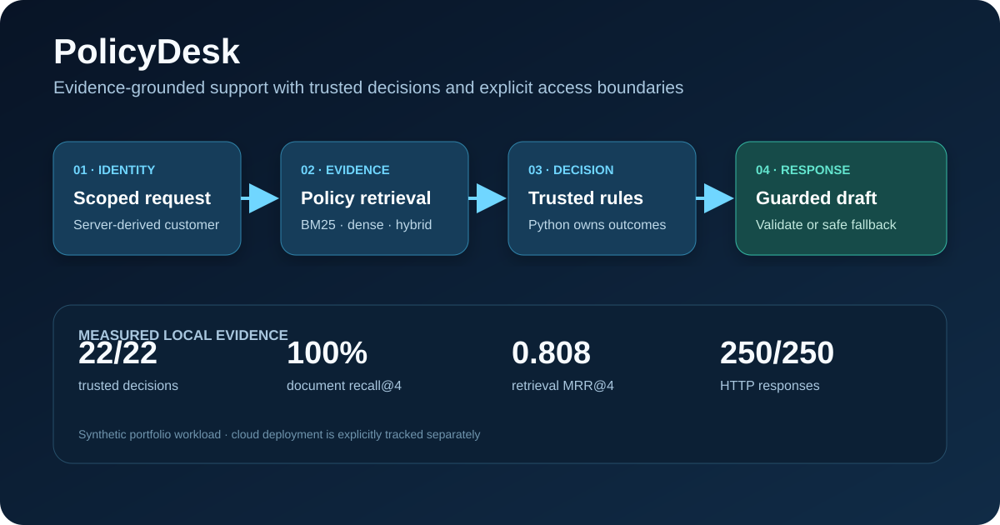

# PolicyDesk

PolicyDesk is a local, evidence-grounded support assistant for a fictional retailer. It retrieves versioned policy text, performs an authorised read-only order lookup, computes policy decisions in trusted Python, and optionally asks Ollama to draft a schema-validated response around that immutable decision.



For a concise interview demonstration, follow the [three-minute walkthrough](docs/demo-walkthrough.md).

| Evidence level | Current state |
|---|---|
| Implemented | Trusted rule decisions, BM25 retrieval, server-derived demo identity, scope/ownership checks, deterministic fallback and optional local generation |
| Tested | 15 automated boundary/API/retrieval/MCP tests, including client-supplied identity rejection, cross-customer access and two independent MCP clients |
| Measured | [22-case deterministic baseline](reports/evaluation-v2.md): 100% decision/status accuracy, 100% document recall@4, 0.808 MRR@4; [local HTTP workload](reports/local-http-benchmark.md): 250/250 successful |
| Deployed | No public cloud resources. The zero-spend release workflow builds and smoke-tests the container on an ephemeral GitHub-hosted runner; Azure remains an unexecuted reference design. |

It works without Ollama using a deterministic fallback. When Ollama is serving at `http://127.0.0.1:11434`, PolicyDesk uses the configured local model to select a valid supporting-evidence subset. Consequential decision language remains a trusted template; generated prose cannot turn an eligibility review into an approval, promise a refund, or otherwise rewrite the Python decision.

## Quick start

```powershell
uv sync --extra dev
uv run policydesk demo
uv run policydesk evaluate --offline
uv run pytest
uv run policydesk serve
uv run python scripts/benchmark_http.py --spawn
```

The API can also run in Docker. On Windows, `host.docker.internal` is not the current default Ollama URL, so the container will use its deterministic fallback unless you expose/configure the Ollama endpoint in code or networking:

```powershell
docker build -t policydesk .
docker run --rm -p 8000:8000 policydesk
```

API example:

```powershell
$headers = @{ Authorization = "Bearer pd-demo-alice" }
Invoke-RestMethod http://127.0.0.1:8000/assist -Method Post -Headers $headers -ContentType application/json -Body '{"ticket":"I want to return this order","order_id":"NS-1001"}'
```

To use Ollama, start its service and ensure the model in `configs/app.yaml` is installed. For example, if `ollama` is on your PATH:

```powershell
ollama serve
ollama pull llama3.2
```

## Reliability design

```text
ticket + authenticated demo customer
  -> intent + BM25 policy retrieval
  -> authorised order lookup
  -> deterministic policy decision
  -> Ollama structured draft (when available)
  -> citation/status validation
  -> safe deterministic fallback
```

- Ticket text cannot change order ownership, dates, value, or rule thresholds.
- Python decides return/cancellation routing and renders the consequential decision language; the model can select only retrieved evidence.
- Unknown orders ask for information and ownership mismatches escalate.
- Missing/invalid model output falls back rather than inventing an answer.
- The included evaluation reports decision accuracy, status accuracy and policy-document retrieval hits across synthetic cases.

See the [product brief](docs/product-brief.md), [threat model](docs/threat-model.md), [evaluation rubric](evals/RUBRIC.md), and authored-corpus [provenance manifest](policies/MANIFEST.yaml).

The evaluation command also supports `--retrieval dense` and `--retrieval hybrid`. These modes use the configured Ollama embedding model and must be measured before making a quality claim. The hybrid implementation fuses BM25 and dense ranks with reciprocal rank fusion; the checked-in headline remains the reproducible BM25 baseline.

The delivery path is documented in [zero-cost cloud evidence](docs/azure-deployment.md)
and the [zero-spend policy](docs/cost-worksheet.md). Public-repository GitHub Actions
compiles the Azure Bicep reference design and exercises the production container without
creating billable cloud resources. No Azure deployment is claimed.

An optional [MCP stdio server](docs/mcp.md) exposes policy search, scoped order lookup and idempotent simulated draft creation using the official SDK. Its integration test performs real protocol initialisation, discovery and calls through two independent client sessions. This is local MCP interoperability evidence, not remote OAuth evidence.

## Honest scope

The policies, orders, identities and benchmark are synthetic. This is not legal advice and is not connected to a real support system. A document-level retrieval hit does not prove every sentence is supported; add a blinded human citation-support audit before making a stronger quality claim. The API maps opaque fixture bearer tokens to customers on the server and enforces scopes. This demonstrates the application trust boundary; the static tokens are not production authentication and a deployment must replace them with validated identity-provider claims.

The next useful additions are Ollama embedding retrieval, a larger held-out paraphrase set, and manually scored citation support. The current version deliberately keeps the decision-to-answer boundary explicit and testable.

The current [synthetic deterministic baseline](reports/evaluation-v2.md) records 22/22 trusted decisions, 22/22 routing statuses, 20/20 expected document hits and 0.808 document MRR@4. The earlier [12-case report](reports/evaluation.md) is retained as historical evidence.
